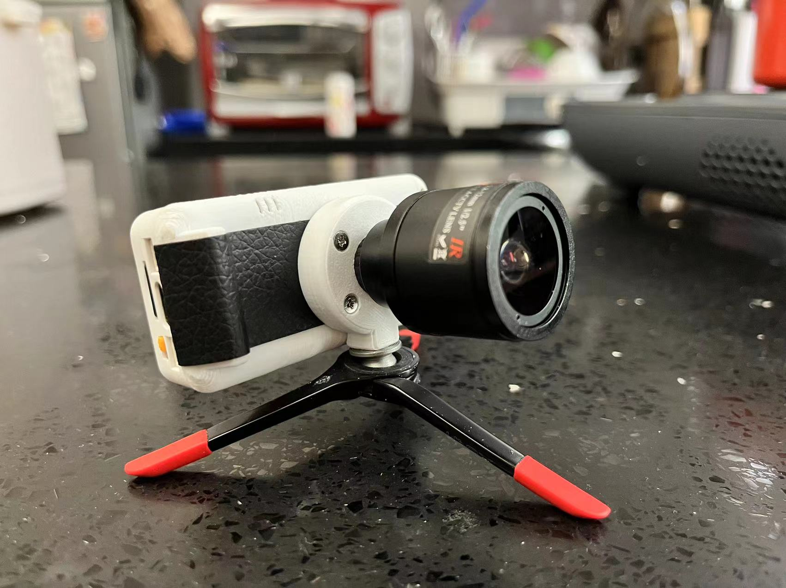

<div align="center" markdown="1">
  
</div>

<h1 align = "center">🌟T-Display-S3-Pro🌟</h1>

[](https://github.com/Xinyuan-LilyGO/T-Display-S3-Pro/actions/workflows/pio.yml)



## Product

| Product(PinMap)                 | SOC        | Flash | PSRAM    | Resolution |
| ------------------------------- | ---------- | ----- | -------- | ---------- |
| [T-Display-S3-Pro][1]           | ESP32-S3R8 | 16MB  | 8MB(OPI) | 222x480    |
| [T-Display-S3-Pro-MVSRBoard][1] |            |       |          |            |
| [T-Display-S3-Pro-MVSRLora][1]  |            |       |          |            |

## Examples

```txt
T-Display-S3-Pro examples
├── examples/Arduino_GFX_HelloWorld           # Arduino_GFX example
├── examples/Arduino_GFX_LvglBenchmark        # Arduino_GFX example
├── examples/Arduino_GFX_PDQgraphicstest      # Arduino_GFX example
├── examples/CameraShield                     # Camera example
├── examples/CapacitiveTouch                  # Capacitive Touch example
├── examples/LTR553ALS_Sensor                 # Light & Proximity Sensor example
├── examples/TFT_eSPI_Simple                  # TFT_eSPI example
├── examples/USB_HID_Example                  # USB Host HID & OTG example
├── examples/UnitTest                         # Hardware unit testing example
├── examples/PMU_Example                      # Power management settings and battery information detection example
├── examples/AdjustBacklight                  # Backlight adjustment example
├── examples/Cellphone                        # With camera that can take pictures, to view the photos in the album (sd card required)
└── examples/factory                          # Factory example

If use the 'examples/Cellphone' examples,
be careful not block the top of the "S3-Pro" screen, if it is blocked, the screen will sleep.

```

The T-Display-S3-Pro backplane-related examples can be found by opening the following link.

1. [T-Display-S3-Pro-MVSRBoard examples](https://github.com/Xinyuan-LilyGO/T-Display-S3-Pro-MVSRBoard)
2. [T-Display-S3-Pro-MVSRLora examples](https://github.com/Xinyuan-LilyGO/T-Display-S3-Pro-MVSRLora)

## PlatformIO Quick Start (Recommended)

1. Install [Visual Studio Code](https://code.visualstudio.com/) and [Python](https://www.python.org/)
2. Search for the `PlatformIO` plugin in the `VisualStudioCode` extension and install it.
3. After the installation is complete, you need to restart `VisualStudioCode`
4. After restarting `VisualStudioCode`, select `File` in the upper left corner of `VisualStudioCode` -> `Open Folder` -> select the `T-Display-S3-Pro` directory
5. Wait for the installation of third-party dependent libraries to complete
6. Click on the `platformio.ini` file, and in the `platformio` column
7. Uncomment one of the lines `default_envs = xxxx` to make sure only one line works
8. Click the (✔) symbol in the lower left corner to compile
9. Connect the board to the computer USB
10. Click (→) to upload firmware
11. Click (plug symbol) to monitor serial output
12. If it cannot be written, or the USB device keeps flashing, please check the **FAQ** below

## Arduino IDE Quick Start

* It is recommended to use platformio without cumbersome steps
* [T-Display-S3-Pro Arduino IDE Record](https://youtu.be/z4w9Qj5ArAw)

1. Install [Arduino IDE](https://www.arduino.cc/en/software)
2. In Arduino Preferences, on the Settings tab, enter the `https://raw.githubusercontent.com/espressif/arduino-esp32/gh-pages/package_esp32_index.json` URL in the `Additional boards manager URLs` input box. **Please pay attention to the version. The test phase is using 2.0.14. It is not certain that versions above 2.0.14 can run. When the operation is abnormal, please downgrade to a version below 2.0.14.** , As of 2024/08/02, TFT_eSPI does not work on versions higher than 2.0.14, see [TFT_eSPI/issue3329](https://github.com/Bodmer/TFT_eSPI/issues/3329)
3. Download `T-Display-S3-Pro` to desktop
4. Copy all folders in [lib folder](./lib/)  to Arduino library folder (e.g. C:\Users\YourName\Documents\Arduino\libraries)
5. Open ArduinoIDE  ,`Tools` , Look at the picture to choose

    | Name                                 | Value                               |
    | ------------------------------------ | ----------------------------------- |
    | Board                                | **ESP32S3 Dev Module**              |
    | Port                                 | Your port                           |
    | USB CDC On Boot                      | Enable                              |
    | CPU Frequency                        | 240MHZ(WiFi)                        |
    | Core Debug Level                     | None                                |
    | USB DFU On Boot                      | Disable                             |
    | Erase All Flash Before Sketch Upload | Disable                             |
    | Flash Mode                           | QIO 80Mhz                           |
    | Flash Size                           | **16MB(128Mb)**                     |
    | Arduino Runs On                      | Core1                               |
    | USB Firmware MSC On Boot             | Disable                             |
    | Partition Scheme                     | **16M Flash (3MB APP/9.9MB FATFS)** |
    | PSRAM                                | **QSPI PSRAM**                      |
    | Upload Speed                         | 921600                              |
    | Programmer                           | **Esptool**                         |

6. Open `T-Display-S3-Pro` -> `examples` -> `any examples` -> `any examples.ino`
7. Select `Port`
8. Click `upload` , Wait for compilation and writing to complete
9. If it cannot be written, or the USB device keeps flashing, please check the **FAQ** below

## Hardware Description

### 📍 Pins Map

| Name                     | GPIO NUM          | Note              |
| ------------------------ | ----------------- | ----------------- |
| SDA                      | 5                 |                   |
| SCL                      | 6                 |                   |
| SPI MISO                 | 8                 |                   |
| SPI MOSI                 | 17                |                   |
| SPI SCLK                 | 18                |                   |
| DISPLAY CS               | 39                |                   |
| DISPLAY MISO             | 8                 | Share SPI Bus     |
| DISPLAY MOSI             | 17                | Share SPI Bus     |
| DISPLAY SCLK             | 18                | Share SPI Bus     |
| BACKLIGHT PIN            | 48                | 16-level dimming  |
| SD CS                    | 14                |                   |
| SD MISO                  | 8                 | Share SPI Bus     |
| SD MOSI                  | 17                | Share SPI Bus     |
| SD SCLK                  | 18                | Share SPI Bus     |
| TOUCH RST                | 13                |                   |
| TOUCH SDA                | SDA               | Share I2C Bus     |
| TOUCH SCL                | SCL               | Share I2C Bus     |
| BUTTON 1                 | 0                 |                   |
| BUTTON 2                 | 12                |                   |
| BUTTON 3                 | 16                |                   |
| On board LED (Green)     | 38                |                   |
| Camera back panel        | Camera back panel | Camera back panel |
| CAMERA RST               | -                 | NC                |
| CAMERA SDA               | 5                 | Share I2C Bus     |
| CAMERA SCL               | 6                 | Share I2C Bus     |
| CAMERA VSYNC             | 7                 |                   |
| CAMERA POWER DOWN        | 46                |                   |
| CAMERA HREF              | 15                |                   |
| CAMERA XCLK              | 4                 |                   |
| CAMERA PCLK              | 2                 |                   |
| CAMERA Y9                | 4                 |                   |
| CAMERA Y8                | 10                |                   |
| CAMERA Y7                | 3                 |                   |
| CAMERA Y6                | 1                 |                   |
| CAMERA Y5                | 42                |                   |
| CAMERA Y4                | 40                |                   |
| CAMERA Y3                | 41                |                   |
| CAMERA Y2                | 45                |                   |
| CAMERA LED               | 38                | Share Onboard LED |
| CAMERA Default frequency | 20MHZ             |                   |

* The early version of T-Display-S3-Pro V1.0 uses PWM for backlight adjustment. The V1.1 upgrade uses backlight constant current drive. The drive method is different. Please see the [example](./examples/AdjustBacklight/AdjustBacklight.ino) for specific usage.

### ✨ Display-Features

| Features              | Params        |
| --------------------- | ------------- |
| Resolution            | 480 x 222     |
| Display Size          | 2.33 Inch     |
| Luminance on surface  | 450 cd/m²     |
| Driver IC             | ST7796U (SPI) |
| Contrast ratio        | 1000:1        |
| Color gamut           | 70%           |
| PPI                   | 221           |
| Display Colors        | 262K          |
| View Direction        | All  (IPS)    |
| Operating Temperature | -20～70°C     |

### 🧑🏼‍🔧 I2C Devices Address

| Devices                         | 7-Bit Address | Share Bus |
| ------------------------------- | ------------- | --------- |
| [PowerManage SY6970][2]         | 0x6A          | ✅️         |
| [Optical Sensor LTR-553ALS][3]  | 0x23          | ✅️         |
| Capacitive Touchscreen CST226SE | 0x5A          | ✅️         |

### ⚡ Electrical parameters

| Features                   | Details                    |
| -------------------------- | -------------------------- |
| 🔗USB-C Input Voltage       | 3.9V-6V                    |
| 🔗USB-C Output Voltage      | 4.55-5.55V                 |
| ⚡USB-C Output Current      | 0.5-1A                     |
| ⚡Charge Current            | 0-5056mA(Programmable)     |
| 🔋Battery Voltage           | 3840~4608mV (Programmable) |
| 🔋Battery capacity          | 3800mV/470mAh              |
| 🔋Battery Connector         | [ACHL Connector 1.2mm][4]  |
| 🔋Charge Temperature  Range | 0~60°                      |

> \[!IMPORTANT]
> ⚠️ Recommended to use a charging current lower than 200mA.
>
> The charging current should not be greater than half of the battery capacity
>
> T-Display-S3-Pro uses the SY6970 power path switching chip. In order to maintain stable power supply when the battery is not connected, the charging function must be turned off. Devices connected to the battery do not need to be turned off. How to turn off charge please refer [here](https://github.com/Xinyuan-LilyGO/T-Display-S3-Pro/blob/c267d7463609e1f6c62e74455ac5048c9ae93bc3/examples/PMU_Example/PMU_Example.ino#L58)

### 💡 LED

| LED       | GPIO | Note                                                                                   |
| --------- | ---- | -------------------------------------------------------------------------------------- |
| Green LED | 38   | If it's a shield with a camera, then this GPIO is shared with the camera's fill light. |
| Red LED   | X    | Charger control                                                                        |

* The red LED will flash when no battery is connected, indicating that no battery is detected. To prevent the LED from flashing, you can turn it off via software. see [FAQ](#faq)

### 🔌 QWIIC Connector

| QWIIC Connector | GPIO                  | Note                |
| --------------- | --------------------- | ------------------- |
| LEFT            | 44,43,3V3,GND         | UART or I2C or GPIO |
| RIGHT           | SCL(6),SDA(5),3V3,GND | Only I2C            |

* Determine direction: The screen should be facing you.

[1]: https://www.lilygo.cc/products/t-display-s3-pro
[2]: https://www.visvie.com/static/upload/file/20220916/1663318546578220.pdf
[3]: https://optoelectronics.liteon.com/upload/download/DS86-2014-0007/LTR-553ALS-01_DS_V1.pdf
[4]: (https://www.jst.com/zh/products/crimp-style-connectors-wire-to-board-type/achl-connector/)

# ESP32 basic examples

* [BLE Examples](https://github.com/espressif/arduino-esp32/tree/master/libraries/BLE)
* [WiFi Examples](https://github.com/espressif/arduino-esp32/tree/master/libraries/WiFi)
* [SPIFFS Examples](https://github.com/espressif/arduino-esp32/tree/master/libraries/SPIFFS)
* [FFat Examples](https://github.com/espressif/arduino-esp32/tree/master/libraries/FFat)
* For more examples of esp32 chip functions, please refer to [arduino-esp32-libraries](https://github.com/espressif/arduino-esp32/tree/master/libraries)

# Datasheet

* [Camera-Shield](./schematic/Camer-Shield.pdf)
* [T-DisplayS3-Pro](./schematic/T-Display-Pro.pdf)
* [T-BHI260](./schematic/T-BHI260_V1.1.pdf)
* [T-Display-S3-Pro-MVSRBoard_V1.0_20240913](./schematic/T-Display-S3-Pro-MVSRBoard_V1.0_20240913.pdf)
* [T-Display-S3-Pro-MVSRBoard_V1.0_20241109](./schematic/T-Display-S3-Pro-MVSRBoard_V1.0_20241109.pdf)

# Case & Dimensions

* Cool back cover design from @moononournation , Design files can be found [dimensions/BackCover](./dimensions/BackCover/)
* [T-Display-Pro PCB](./dimensions/T-Display-Pro-PCB.DWG)
* [T-Display-Pro-Vice-Shield](./dimensions/T-Display-Pro-Vice-Shield.dxf)
* [T-Display-Pro-Vice-Shield Gerber](./dimensions/T-Display-Pro-Vice-Shield%20Gerber%2023-11-23.zip)
* [T-BHI260.kicad_mod](./schematic/kicad_sensor.pretty/T-BHI260.kicad_mod)
* [T-CIM29048.kicad_mod](./schematic/kicad_sensor.pretty/T-CIM29048.kicad_mod)

# FAQ

1. The board uses USB as the JTAG upload port. When printing serial port information on USB_CDC_ON_BOOT configuration needs to be turned on.
If the port cannot be found when uploading the program or the USB has been used for other functions, the port does not appear.
Please enter the upload mode manually.
   1. Connect the board via the USB cable
   2. Press and hold the BOOT button , While still pressing the BOOT button, press RST
   3. Release the RST
   4. Release the BOOT button
   5. Upload sketch

2. If the above is invalid, burn the [binary file](./firmware/README.MD)  to check whether the hardware is normal
3. The OTG external power supply function requires turning on the  [PMU OTG enablement](https://github.com/Xinyuan-LilyGO/T-Display-S3-Pro/blob/d7f15b379da2b6f711998315401c02a740a8bfa8/examples/CameraShield/CameraShield.ino#L65). If the USB input is connected and the OTG is set to output, the battery will not be charged.
4. Turning the physical switch to OFF will completely disconnect the battery from the motherboard. When charging is required, turn the switch to ON.
5. When the battery is not connected and the USB is plugged in, the board's LED status indicator light will flash. You can use `PMU.disableStatLed();` to turn off the indicator light, but this means that if the battery is connected for charging, the LED light will also be disabled. If you need to enable the charging status indicator, please call `PMU.enableStatLed();`
6. Device shuts down suddenly?

  - When the battery is connected, the device will not shut down suddenly. Sudden shutdown will only occur when the device is not connected to the battery. The solution is to turn off the charging function of SY6970. How to turn off charge please refer [here](https://github.com/Xinyuan-LilyGO/T-Display-S3-Pro/blob/c267d7463609e1f6c62e74455ac5048c9ae93bc3/examples/PMU_Example/PMU_Example.ino#L58)

# Depends on required libraries

* [XPowersLib](https://github.com/lewisxhe/XPowersLib)
* [SensorLib](https://github.com/lewisxhe/SensorLib)
* [lvgl 8.3.1](https://github.com/lvgl/lvgl)
* [TFT_eSPI](https://github.com/Bodmer/TFT_eSPI)
* [TouchLib](https://github.com/mmMicky/TouchLib)
* [Arduino_GFX](https://github.com/moononournation/Arduino_GFX)
* [MPU9250](https://github.com/hideakitai/MPU9250)
* [MPU6050](https://github.com/electroniccats/mpu6050)
* [ESP32_USB_Stream-0.0.1](https://github.com/esp-arduino-libs/ESP32_USB_Stream)
* [ESP32-audioI2S-3.0.8](https://github.com/schreibfaul1/ESP32-audioI2S)
* [JPEGDEC-1.2.8](https://github.com/bitbank2/JPEGDEC)
