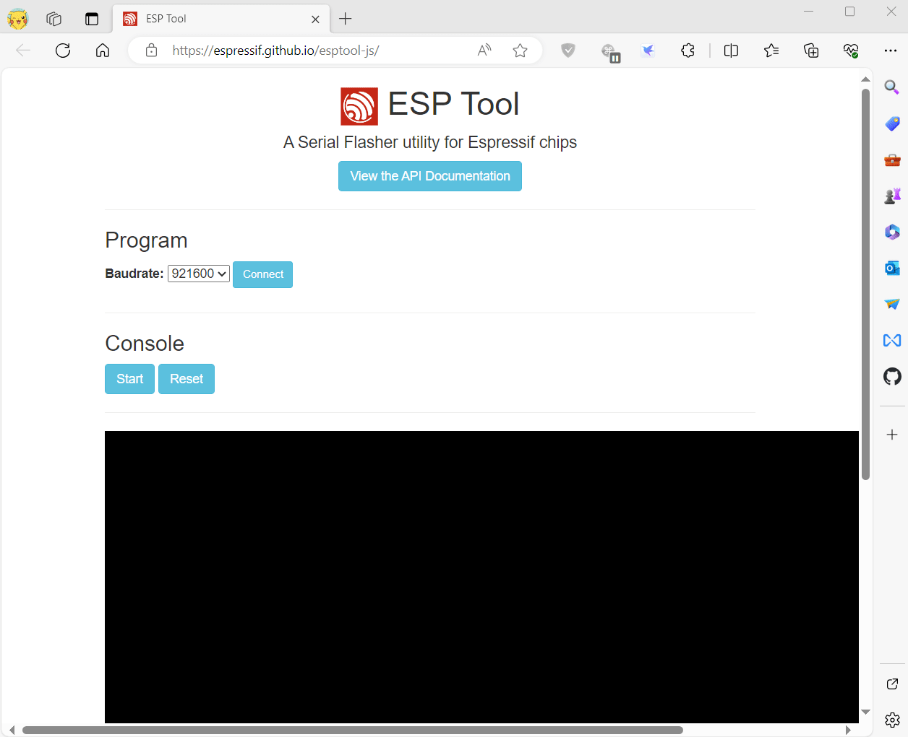
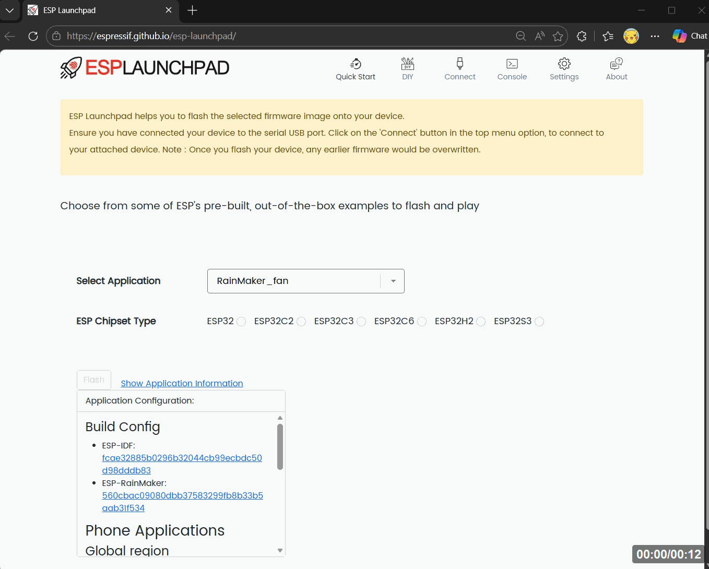

# How to Flash Firmware

## Table of Contents

1. [Firmware](#firmware)
2. [Enter Download Mode](#enter-download-mode)
3. [Flash Methods](#flash-methods)
   - [ESP-Launchpad Online](#esp-launchpad-online)
   - [ESP Download Tool](#use-esp-download-tool)
   - [Web Flasher](#use-web-flasher)
   - [Command Line](#use-command-line)
4. [Verify Flashing Success](#verify-flashing-success)
   - [Check Boot Log](#check-boot-log)

## Firmware

The difference between V1.0 and V1.1 is that the backlight driver is different. If the wrong firmware is flashed, the backlight may not work correctly.

| Firmware                          | Description                                                                                              |
| --------------------------------- | ----------------------------------------------------------------------------------------------------- |
| Factory_1.x.bin                   | Default factory-installed desktop firmware                                                            |
| UnitTest_V1.x_Release.bin         | Firmware for testing hardware, outputting debugging information to Qwiic UART                         |
| UnitTest_V1.x_Debug.bin           | Firmware for testing hardware, output debugging information to USB CDC                                |
| UnitTest_V1.x_DiscChg_Release.bin | Firmware for testing hardware, disable charge function, outputting debugging information to Qwiic UART |
| UnitTest_V1.x_DiscChg_Debug.bin   | Firmware for testing hardware, disable charge function, output debugging information to USB CDC        |

## Enter Download Mode

> [!CAUTION]
> Before flashing, you need to know how to put your device into download mode.

1. Connect the board via USB cable
2. Press and hold the **BOOT** button
3. While holding BOOT, press **RST**
4. Release RST
5. Release BOOT
6. Retry upload
7. If the USB port is recognized, the device enters download mode.

## Flash Methods

### ESP-Launchpad Online

- [Esp-launchpad](https://espressif.github.io/esp-launchpad/)


* Note that after flashing is completed, you need to press RST to reset.

### Use ESP Download Tool

- Download [Flash_download_tool](https://dl.espressif.com/public/flash_download_tool.zip)


* Note that after flashing is completed, you need to press RST to reset.

### Use Web Flasher

- [ESP Web Flasher Online](https://espressif.github.io/esptool-js/)



* Note that after flashing is completed, you need to press RST to reset.

### Use Command Line

If prompted to install Developer Tools, do so.

```bash
python3 -m pip install --upgrade pip
python3 -m pip install esptool
```

To launch esptool.py, run:

```bash
python3 -m esptool
```

For ESP32-S3, use the following command to flash:

```bash
esptool --chip esp32s3  --baud 921600 --before default_reset --after hard_reset write_flash -z --flash_mode dio --flash_freq 80m 0x0 firmware.bin
```


## Verify Flashing Success

### Check Boot Log



* If you can see the device's boot log printed by resetting it serially, and the USB port is recognized, then it has booted normally.
* If the USB port is not recognized and is flashing after uploading, it may be due to an incorrect firmware address. Generally, the write address for LilyGo firmware is 0x00.
